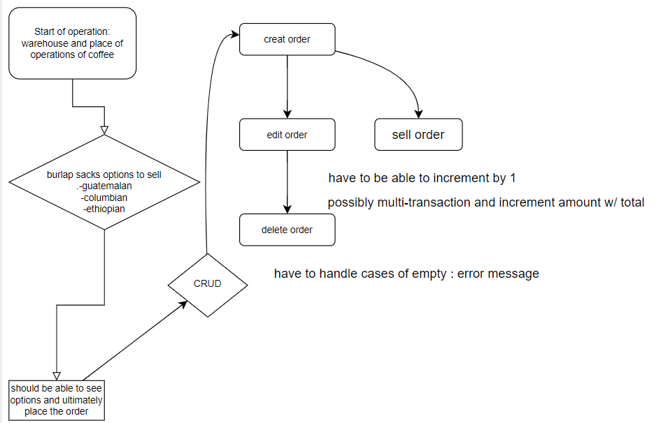

# <span style="color: Pink">Doomed Coffee Shop

#### By **Remy Flores**

#### **Doomed Coffee Shop**

## Index

1. [Technologies Used](#1)
2. [Description](#2)
3. [Webpage](#3)
4. [Setup/Installation Requirements](#4)
5. [Step by Step Guide](#5)
6. [Known Bugs](#6)
7. [License](#7)

## <a name="1" id="1"></a><span style="color: Pink">Technologies Used
* VSCode
* JavaScript
* Chakra UI
* Tailwind
* JSX
* Node
* React
* Babel
* ESLint

## <a name="2" id="2"></a><span style="color: Pink">Description
_Creating a web application for Doomed Coffee Shop where users can order coffee and other treats online. The app allows users to place an order, and every time they click the sell button, the quantity of the coffee decreases by 1._
<br><br>
_How we got there is by our step by step creation_ 
<br><small><span style="color:pink">see flowchat bellow</small>


## <a name="3" id="3"></a><span style="color: Pink">Webpage
* [https://github.com/RemyXVX/Doomed-Coffe-Shop]()

## <a name="4" id="4"></a><span style="color: Pink">Setup/Installation Requirements
* _Chrome web browser for best compatibility_
* _Have a prompt and editor to apply changes, like VSCode and Gitbash_

&nbsp;&nbsp;&nbsp;&nbsp;&nbsp;&nbsp;&nbsp;&nbsp;&nbsp;&nbsp;[Download here for VScode](https://code.visualstudio.com/download)<br>
&nbsp;&nbsp;&nbsp;&nbsp;&nbsp;&nbsp;&nbsp;&nbsp;&nbsp;&nbsp;[Download here for Gitbash](https://git-scm.com/downloads)

* _Installation of Node.js and npm_

&nbsp;&nbsp;&nbsp;&nbsp;&nbsp;&nbsp;&nbsp;&nbsp;&nbsp;&nbsp;[Download here](https://nodejs.org/en/download/)

## <a name="5" id="5"></a><span style="color: Pink">Step by step breakdown on how to run application:

<big>Copy by running:</big>

```
git clone "https://github.com/RemyXVX/Doomed-Coffe-Shop"
```

<big>I would recommend also setting up your work environment after cloning by:</big>

```
npm install
```

<big>Check if the application compiles without any bugs:</big>

```
npm run build
```

<big>Once we have the program started, run:</big>

```
npm run start
```

<big>Now you can access the application in your web browser at `http://localhost:3000`.</big>

## <a name="6" id="6"></a> <span style="color: Pink">Known Bugs
* _Have the application running correctly without any known bugs. I have thoroughly tested and resolved any issues that were identified._
* _<strong>Contact Page and Login</strong>: I have added a contact page where users can reach out to me for inquiries or feedback. The contact form is set up to send emails directly to my email address. Please note that the current links on the page are placeholders and will be updated with relevant social media links. I am also actively working on implementing a login functionality. Progress has been made, and the user information is securely stored in the database. I am finalizing the remaining steps to enable seamless user login. Once completed, users will be able to access personalized features and information._
* _If any issues or bugs are discovered, please feel free to reach out to me via email at remyfranciscoflores@gmail.com._

## <a name="7" id="7"></a><span style="color: Pink">License
* **SEE LICENSE [HERE](./LICENSE)** 
